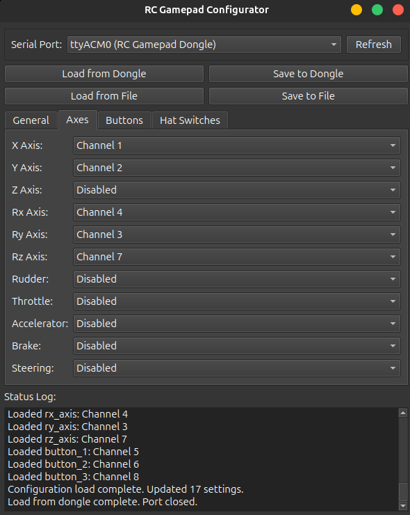

# RC Gamepad Dongle


Turn your RC receiver into a USB game controller. This Arduino-based adapter converts RC signals (IBUS, PPM, SBUS, and more) into standard USB HID joystick inputs that work with Windows, Linux, Mac, Android, and any device that recognizes USB game controllers.

## What Does It Do?

The RC Gamepad Dongle bridges the gap between your RC receiver and your computer. Whether you're using it for flight simulators, robot control, or custom gaming setups, this dongle translates your RC radio signals into joystick inputs that any software can understand.

The project includes Arduino firmware for the dongle itself and a desktop configurator app that makes setup straightforward.

## Key Features

- **Full HID Support**: 6 axes, 32 buttons, and 2 hat switches
- **Multiple RC Protocols**: IBUS, PPM, SBUS, CRSF, DSMX, DSM2, FPORT
- **Easy Configuration**: Map any RC channel to any joystick control
- **Simple Hardware**: Based on the affordable Arduino Pro Micro
- **Cross-Platform**: Works on Windows and Linux

## Project Structure

```
RC-Gamepad-Dongle/
├── assets/              # All project assets
│   ├── images/          # Screenshots, photos, diagrams
│   ├── fritzing/        # Fritzing circuit designs  
│   ├── desktop/         # Desktop application files
│   └── default.json     # Default configuration file
├── firmware/            # Arduino firmware (PlatformIO)
├── software/            # Desktop configurator application
│   └── configurator/    # Python-based configuration tool
├── hardware/            # PCB designs and manufacturing files
│   └── pcb/             # Gerber files, schematics, BOM
├── docs/                # Project documentation
└── README.md           # This file
```

## Hardware You'll Need

### Parts List

- **Arduino Pro Micro** (16MHz/5V version)
- **10kΩ resistor** (for the mode switch)
- **Toggle switch** (to switch between config and joystick modes)
- **WS2812 LED** (optional, gives you visual status feedback)

## Building Your Dongle

You can build this project two ways: breadboard prototype or custom PCB.

### Option 1: Breadboard Build


**Pin Connections:**
- **Pin 0 (RX)**: Connect your RC receiver signal here
- **Pin 3**: Mode switch (HIGH for config mode, LOW for joystick mode)
    - Connect 10kΩ resistor to ground
- **Pin 5**: Optional WS2812 LED for status indication
- **GND**: Ground connection
- **VCC**: 5V power

### Option 2: Custom PCB

If you want a cleaner build, there's a custom PCB design with all the features built in, including a hardware inverter for SBUS receivers.


*The custom PCB provides a compact, professional solution with proper connectors and built-in SBUS inverter*

All the files you need are in `hardware/pcb/`:

- **[Gerber files](hardware/pcb/Gerber_RC-Gamepad-Dongle_V0.1_2025-11-13.zip)**: Ready to send to your PCB manufacturer
- **[Schematic](hardware/pcb/SCH_RC-Gamepad-Dongle%20V0.1_2025-11-13.pdf)**: Full circuit diagram
- **[BOM](hardware/pcb/BOM_RC-Gamepad-Dongle%20V0.1_RC-Gamepad-Dongle%20V0.1_2025-11-13.xlsx)**: Complete parts list with quantities

## Getting Started

### Step 1: Flash the Firmware

First, upload the firmware to your Arduino Pro Micro:

```bash
cd firmware/
pio run --target upload
```

### Step 2: Run the Configurator

**Pre-built Applications:**
- **Windows:** Download and run the `.exe` file from releases
- **Linux:** Download and run the `.AppImage` file from releases

**Or build from source:**
```bash
cd software/configurator/
python -m venv .venv
source .venv/bin/activate  # Windows: .venv\Scripts\activate
pip install -r requirements.txt
cd src/
python rc-gamepad-dongle.py
```

### Step 3: Configure Your Channels

1. Flip your mode switch to config mode (pin 3 HIGH)
2. Plug the dongle into your computer via USB
3. Open the configurator app
4. Pick your RC protocol from the dropdown
5. Map your RC channels to the joystick controls you want
6. Click save to write the configuration to the dongle
7. Flip the mode switch back to joystick mode (pin 3 LOW)


*General configuration tab showing protocol selection and basic settings*


*Axes configuration tab for mapping RC channels to joystick controls*

That's it! Your dongle is now ready to use as a game controller.

## Supported RC Protocols

| Protocol | Status | Baud Rate | Notes |
|----------|--------|-----------|-------|
| IBUS | ✅ Tested | 115200 | Works great with FlySky receivers |
| PPM | ✅ Tested | N/A | Standard 8-channel PPM |
| SBUS | ⚠️ Untested | 100000 | Needs hardware inverter (included in PCB) |
| CRSF | ⚠️ Untested | 420000 | TBS Crossfire protocol |
| DSMX | ⚠️ Untested | 115200 | Spektrum DSMX receivers |
| DSM2 | ⚠️ Untested | 115200 | Spektrum DSM2 receivers |
| FPORT | ⚠️ Untested | 115200 | FrSky F.Port protocol |

**Note:** Protocols marked as untested are implemented according to their specifications but haven't been verified with actual hardware yet. If you test one of these, please let us know how it goes!

## Building From Source

### Building the Configurator

**Windows:**
```powershell
cd software/configurator/scripts/windows/
.\build-exe.ps1
```

**Linux:**
```bash
cd software/configurator/scripts/linux/
./build-appimage.sh
```

### Building the Firmware

```bash
cd firmware/
pio run                    # Compile the firmware
pio run --target upload    # Upload to your Arduino
pio device monitor         # Monitor serial output
```

## Documentation

For detailed documentation, see the `docs/` directory:

- **[Hardware Guide](hardware/README.md)** - PCB designs, assembly instructions, troubleshooting
- **[Firmware Guide](firmware/README.md)** - Arduino code, protocol implementation, status LEDs  
- **[Software Guide](software/README.md)** - Configurator app, building from source
- **[Complete Documentation](docs/README.md)** - Project overview, setup instructions

## License

This project is released under the MIT License - see [LICENSE](LICENSE) for details.

## Contributing

Want to help improve this project? Pull requests are welcome! I'd especially appreciate help testing the protocols that haven't been verified yet (SBUS, CRSF, DSM, and FPORT). If you have one of these receivers, give it a try and let us know how it works.
