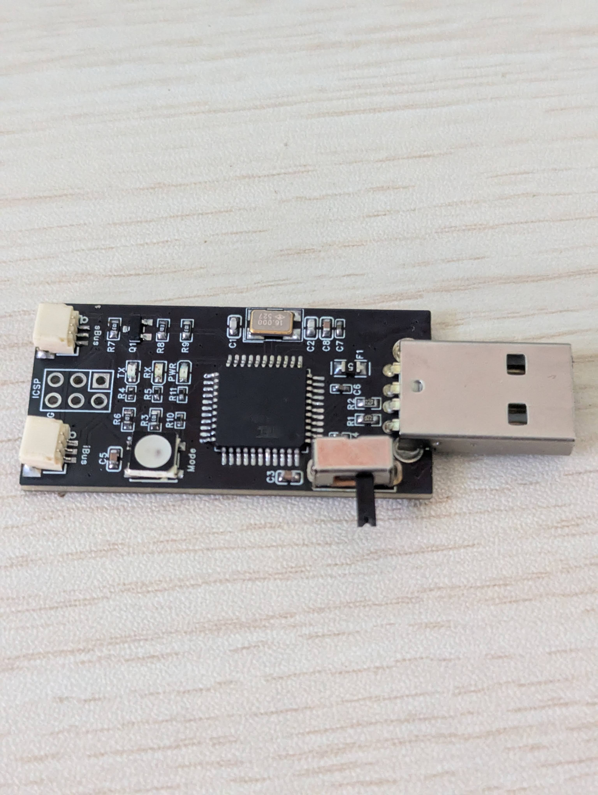

# Hardware Documentation

This directory contains hardware designs and manufacturing files for the RC Gamepad Dongle.

## PCB Design

The custom PCB provides a complete solution with proper connectors and built-in signal conditioning.


*Professional PCB design with Arduino Pro Micro socket, RC connectors, and integrated SBUS inverter*

### Features
- **Arduino Pro Micro socket** - Uses standard Pro Micro pinout
- **RC input connectors** - Proper 3-pin servo connectors for clean wiring  
- **Hardware SBUS inverter** - Built-in inverter for SBUS protocol support
- **Status LED** - Integrated WS2812 RGB LED for visual feedback
- **Mode switch** - Hardware toggle between config and joystick modes
- **Compact design** - Fits in standard project enclosures

### Manufacturing Files

All files are located in `pcb/`:

- **`Gerber_RC-Gamepad-Dongle_V0.1_2025-11-13.zip`** - Complete Gerber files ready for PCB manufacturing
- **`SCH_RC-Gamepad-Dongle V0.1_2025-11-13.pdf`** - Schematic diagram (PDF)
- **`BOM_RC-Gamepad-Dongle V0.1_RC-Gamepad-Dongle V0.1_2025-11-13.xlsx`** - Bill of Materials with part numbers and quantities
- **`DXF_RC-Gamepad-Dongle V0.1_2025-11-13_AutoCAD2007.dxf`** - Mechanical dimensions for enclosure design

### PCB Manufacturing

1. Upload the Gerber ZIP file to your preferred PCB manufacturer:
   - **JLCPCB** - Low cost, good quality
   - **PCBWay** - Premium options
   - **OSH Park** - Made in USA, purple boards

2. Recommended settings:
   - **Layers**: 2
   - **PCB Thickness**: 1.6mm  
   - **Surface Finish**: HASL (or ENIG for better quality)
   - **Copper Weight**: 1oz

3. Order components from the BOM spreadsheet

### Assembly Notes

- **Computer not recognizing the dongle:**
- Verify your Arduino Pro Micro is functioning (should show up as a COM port)
- Try a different USB cable
- Check that the firmware uploaded successfully
- If bootloader is corrupted, use ICSP programming method above

**Firmware upload fails:**
- Check that the correct board is selected (SparkFun Pro Micro)
- Verify the correct processor (ATmega32U4 5V, 16MHz)
- Try pressing reset button twice quickly before upload
- If bootloader is missing/corrupted, burn bootloader using ICSP method
- **Connectors**: Standard 3-pin servo connectors work well
- **LED**: Any WS2812 or WS2812B works
- **Switch**: Standard SPDT toggle switch

### Programming the Arduino Pro Micro

The custom PCB includes an ICSP (In-Circuit Serial Programming) header that allows you to program the Arduino Pro Micro directly on the board, including burning the bootloader if needed.

#### Method 1: USB Programming (Recommended)

If your Arduino Pro Micro already has a bootloader:

1. Connect the PCB to your computer via USB
2. Follow the firmware upload instructions in the main documentation

#### Method 2: ICSP Programming (For New/Corrupted Bootloaders)

If your Arduino Pro Micro doesn't have a bootloader or it's corrupted, you can use an Arduino Uno as an ISP programmer:

**What You'll Need:**
- Arduino Uno (as ISP programmer)
- 6 jumper wires
- The custom PCB with Arduino Pro Micro installed

**ICSP Header Pinout:**
```
ICSP Header on PCB:
┌─────┬─────┐
│ MISO│ VCC │  1: MISO  2: VCC (5V)
├─────┼─────┤
│ SCK │ MOSI│  3: SCK   4: MOSI  
├─────┼─────┤
│ RST │ GND │  5: RST   6: GND
└─────┴─────┘
```

**Wiring Connections:**
| Arduino Uno | ICSP Header | Wire Color (Suggested) |
|-------------|-------------|------------------------|
| Pin 10      | RST (5)     | Orange                |
| Pin 11      | MOSI (4)    | Blue                  |
| Pin 12      | MISO (1)    | Green                 |
| Pin 13      | SCK (3)     | Yellow                |
| 5V          | VCC (2)     | Red                   |
| GND         | GND (6)     | Black                 |

**Steps:**

1. **Prepare the Arduino Uno as ISP:**
   ```bash
   # Open Arduino IDE
   # File → Examples → 11.ArduinoISP → ArduinoISP
   # Select Arduino Uno board and port
   # Upload the ArduinoISP sketch
   ```

2. **Connect the wires** according to the table above

3. **Install SparkFun Pro Micro board support** (if not already installed):
   ```
   # In Arduino IDE:
   # File → Preferences
   # Add to Additional Board Manager URLs:
   # https://raw.githubusercontent.com/sparkfun/Arduino_Boards/main/IDE_Board_Manager/package_sparkfun_index.json
   # Tools → Board → Boards Manager
   # Search "SparkFun AVR Boards" and install
   ```

4. **Burn the bootloader:**
   ```bash
   # In Arduino IDE:
   # Tools → Board → SparkFun Pro Micro
   # Tools → Processor → ATmega32U4 (5V, 16MHz)
   # Tools → Programmer → Arduino as ISP
   # Tools → Burn Bootloader
   ```

5. **Verify bootloader installation:**
   - Disconnect ICSP wires
   - Connect USB cable to the PCB
   - The Pro Micro should enumerate as a USB device
   - You can now upload firmware normally via USB

**Troubleshooting ICSP Programming:**

- **"Device signature = 0x000000"**: Check all wiring connections, ensure power is connected
- **"avrdude: stk500_recv(): programmer is not responding"**: Verify ArduinoISP sketch is uploaded to Uno
- **"avrdude: verification error"**: Try adding a 10μF capacitor between RESET and GND on the Arduino Uno
- **Board not detected after bootloader burn**: Try pressing the reset button twice quickly to enter bootloader mode

## Breadboard Alternative

For prototyping or one-off builds, you can build on a breadboard using the Fritzing diagrams in `../assets/fritzing/`.

### Breadboard Parts
- Arduino Pro Micro (16MHz/5V)
- 10kΩ resistor
- SPDT toggle switch  
- WS2812 LED (optional)
- Breadboard and jumper wires

### Connections
- **Pin 0 (RX)**: RC receiver signal
- **Pin 3**: Mode switch (with 10kΩ pulldown to ground)
- **Pin 5**: WS2812 LED data line
- **GND/VCC**: Power connections

See wiring diagrams: `../assets/images/ProMicroImplementation.fzpz_bb.png`

## SBUS Considerations

SBUS uses an inverted serial signal that requires hardware inversion:

- **PCB build**: Inverter is built into the PCB
- **Breadboard build**: You'll need to add an external inverter circuit or use a different protocol

## Troubleshooting

### Common Issues

**No RC signal detected:**
- Check receiver is bound and powered
- Verify correct protocol selected in configurator
- Ensure signal wire connected to Pin 0

**SBUS not working on breadboard:**
- SBUS requires hardware signal inversion
- Use the PCB design or add inverter circuit
- Alternative: use IBUS or PPM instead

**Status LED not working:**
- Check LED power (3.3V-5V)
- Verify data line connected to Pin 5
- Ensure correct LED type (WS2812/WS2812B)

**Computer not recognizing the dongle:**
- Verify your Arduino Pro Micro is functioning (should show up as a COM port)
- Try a different USB cable
- Check that the firmware uploaded successfully
- If bootloader is corrupted, use ICSP programming method above

**Firmware upload fails:**
- Check that the correct board is selected (SparkFun Pro Micro)
- Verify the correct processor (ATmega32U4 5V, 16MHz)
- Try pressing reset button twice quickly before upload
- If bootloader is missing/corrupted, burn bootloader using ICSP method

For more troubleshooting, see the main project README.

## Supported RC Protocols

| Protocol | Status | Baud Rate | Notes |
|----------|--------|-----------|-------|
| **IBUS** | ✅ Tested | 115200 | Works great with FlySky receivers |
| **PPM** | ✅ Tested | N/A | Standard 8-channel PPM |
| **SBUS** | ⚠️ Untested | 100000 | Needs hardware inverter (included in PCB) |
| **CRSF** | ⚠️ Untested | 420000 | TBS Crossfire protocol |
| **DSMX** | ⚠️ Untested | 115200 | Spektrum DSMX |
| **DSM2** | ⚠️ Untested | 115200 | Spektrum DSM2 |
| **FPORT** | ⚠️ Untested | 115200 | FrSky F.Port |

**Note:** Only IBUS and PPM have been verified with actual hardware. The other protocols are implemented according to their specs but need testing.
