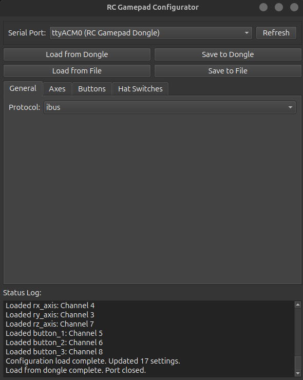

# Software

This directory contains all software components for the RC Gamepad Dongle project.

## Configurator Application

The `configurator/` directory contains the desktop application used to set up and configure the RC Gamepad Dongle.

### Features
- **Protocol Selection** - Choose from IBUS, PPM, SBUS, CRSF, DSMX, DSM2, FPORT
- **Channel Mapping** - Map RC channels to joystick axes, buttons, and hat switches
- **Real-time Preview** - See RC input values in real-time during configuration
- **Configuration Storage** - Save settings directly to the dongle's EEPROM
- **Cross-platform** - Runs on Windows and Linux


*The configurator provides an intuitive interface for setting up your RC gamepad dongle*

### Quick Start

**Pre-built Applications:**
- Download the latest release for your platform
- Windows: Run the `.exe` file
- Linux: Run the `.AppImage` file

**From Source:**
```bash
cd configurator/
python -m venv .venv
source .venv/bin/activate  # Windows: .venv\Scripts\activate  
pip install -r requirements.txt
cd src/
python rc-gamepad-dongle.py
```

### Building

**Windows:**
```powershell
cd configurator/scripts/windows/
.\build-exe.ps1
```

**Linux:**
```bash
cd configurator/scripts/linux/
./build-appimage.sh
```

## Configuration Workflow

1. **Hardware Setup** - Connect your RC receiver to the dongle
2. **Switch to Config Mode** - Set the mode switch to HIGH (config position)  
3. **Connect USB** - Plug the dongle into your computer
4. **Run Configurator** - Open the desktop application
5. **Select Protocol** - Choose your RC receiver protocol from the dropdown
6. **Map Channels** - Assign RC channels to joystick controls as needed
7. **Save Configuration** - Write the settings to the dongle's memory
8. **Switch to Joystick Mode** - Set the mode switch to LOW (joystick position)

The dongle will now operate as a USB game controller using your configured settings.

## Development

The configurator is built with:
- **Python 3.8+** - Core language
- **PySide6** - GUI framework (Qt for Python)
- **PyInstaller** - Application packaging
- **Pillow** - Image processing

### Project Structure
```
configurator/
├── src/                    # Source code
│   ├── rc-gamepad-dongle.py   # Main application
│   └── *.spec              # PyInstaller specifications
├── scripts/                # Build scripts
│   ├── windows/            # Windows build tools
│   └── linux/              # Linux build tools
├── requirements.txt        # Python dependencies
└── README.md              # Configurator documentation
```

For detailed development setup, see `configurator/README.md`.